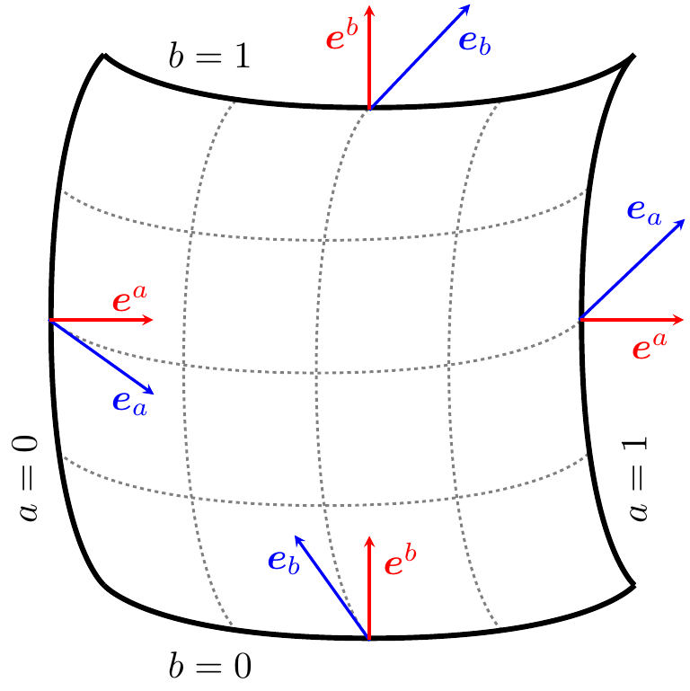
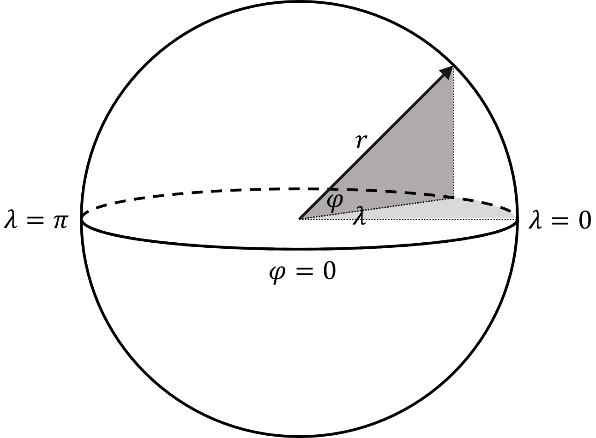
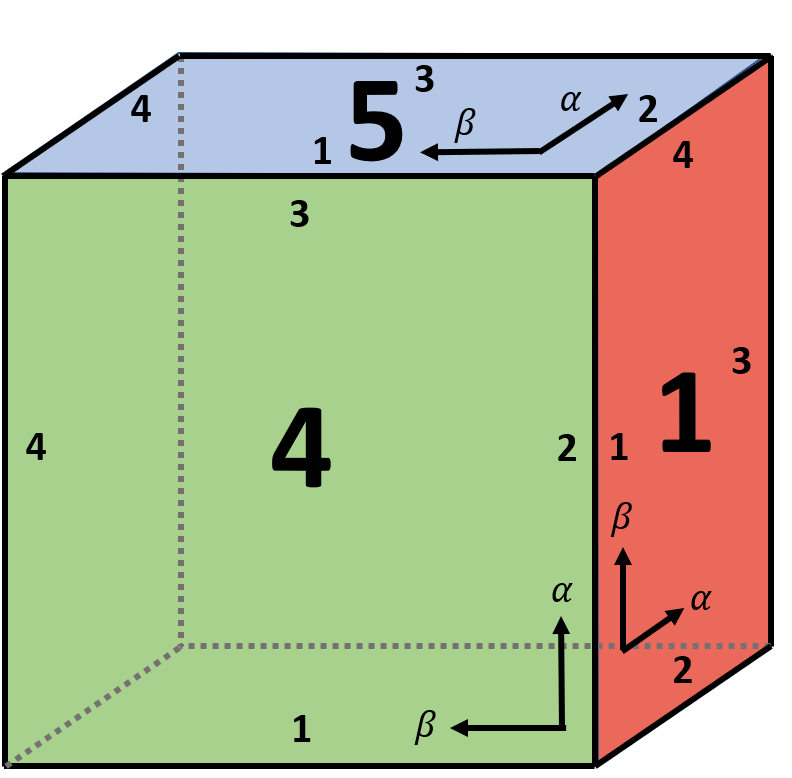
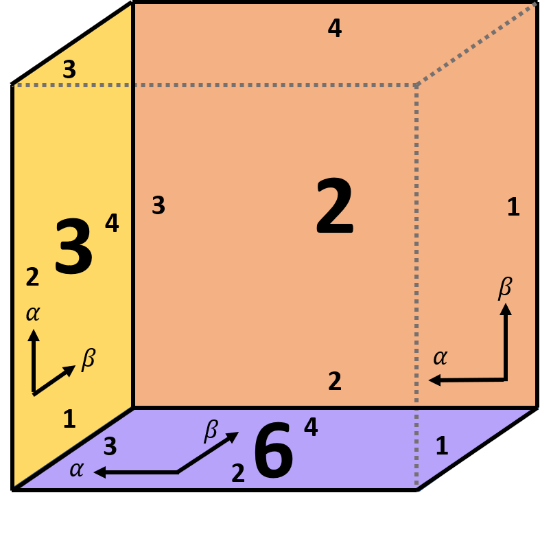
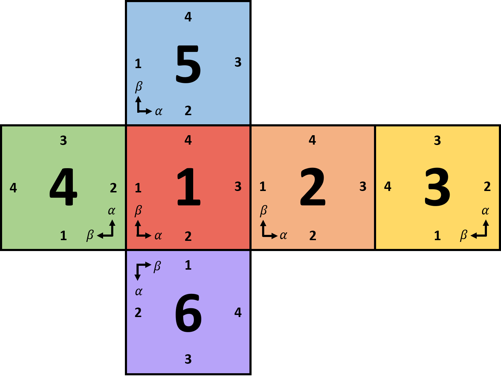

.. ------------------------------------------------------------------------------
     (c) Crown copyright Met Office. All rights reserved.
     The file LICENCE, distributed with this code, contains details of the terms
     under which the code may be used.
   ------------------------------------------------------------------------------

.. _coordinates_and_vectors_coordinate_systems:

Coordinate Systems on the Sphere
================================

This page converts the coordinate-system material from the source notes into
Sphinx documentation. It covers the geometric definitions used in GungHo for
Cartesian, spherical polar and equiangular cubed-sphere coordinates, and then
describes how these systems are combined with mesh rotation and stretching.

Notation and Definitions
------------------------

Let :math:`\mathbf{X}` denote the field of position vectors. A general
coordinate system :math:`f` is defined through a set of coordinate variables
:math:`\chi^{(f)} = \{\chi_i^{(f)} : i \in (1, \dots, N)\}`.

The mapping from a general coordinate system to geocentric Cartesian
coordinates :math:`\chi^{(XYZ)} = \{X, Y, Z\}` is written as
:math:`\chi^{(XYZ)} = \mathcal{F}[\chi^{(f)}]`, with components

.. math::

    \chi_i^{(XYZ)} = F_i(\chi^{(f)}), \qquad
    \chi_i^{(f)} = F_i^{-1}(\chi^{(XYZ)}).

As in the source notes, :math:`\mathcal{F}` is generally nonlinear and cannot
be represented by a matrix.

For each coordinate :math:`\chi_i^{(f)}`:

* the primal basis vector is defined by

  .. math::

      \mathbf{e}_{(f_i)} = \frac{\partial \mathbf{X}}{\partial \chi_i^{(f)}};

* the dual basis vector is defined by

  .. math::

      \mathbf{e}^{(f_i)} = \nabla \chi_i^{(f)}.

    Primal and dual basis vectors for a generic non-orthogonal coordinate
    system.

The components of the basis vectors relate to the transformation
:math:`\mathcal{F}` as

.. math::

    \left[\mathbf{e}_{(f_i)}\right]_j = \frac{\partial F_j}{\partial \chi_i^{(f)}}, \qquad
    \left[\mathbf{e}^{(f_i)}\right]_j = \frac{\partial F_i^{-1}}{\partial \chi_j^{(XYZ)}}.

The metric tensor :math:`g^{(f)}` is the symmetric rank-2 tensor defined by

.. math::

    g^{(f)}_{ij} = \mathbf{e}_{(f_i)} \cdot \mathbf{e}_{(f_j)}.

It is used to define line and volume elements:

.. math::

    \mathrm{d}l^{(f)} = \sqrt{\sum_{ij} g_{ij}\,\mathrm{d}\chi_i^{(f)}\,\mathrm{d}\chi_j^{(f)}}, \qquad
    \mathrm{d}V^{(f)} = \sqrt{\det(g)}\prod_i \mathrm{d}\chi_i^{(f)}.

The Jacobian for a transform from coordinates :math:`f` to :math:`h` is

.. math::

    J_{ij}^{(h,f)} = \frac{\partial \chi_i^{(h)}}{\partial \chi_j^{(f)}}.

If :math:`h` is the Cartesian system, then the Jacobian columns are the primal
basis vectors:

.. math::

    J_{ij}^{(XYZ,f)} = \frac{\partial \chi_i^{(XYZ)}}{\partial \chi_j^{(f)}} =
    \left[\mathbf{e}_{(f_j)}\right]_i.

This gives the compact relation

.. math::

    g^{(f)} = \left(\mathbf{J}^{(XYZ,f)}\right)^T \mathbf{J}^{(XYZ,f)}.

Native Coordinates and Mesh Transformations
-------------------------------------------

The native coordinates of a mesh are the coordinates that exactly describe the
coordinate lines used to create the mesh. In this document, native coordinates
are denoted with a dot, for example :math:`\dot{\chi}^{(f)}`.

In general, the mesh used in GungHo may be rotated and stretched from the
basic longitude-latitude or equiangular cubed-sphere mesh. These operations
occur in the following order:

1. the mesh is stretched by a factor :math:`s` towards the North Pole;
2. the mesh is rotated by an angle :math:`\vartheta` about the original North
   Pole;
3. the North Pole of the mesh is rotated to a new location, with longitude
   :math:`\lambda_N` and latitude :math:`\varphi_N`.

The full mapping can be written as

.. math::

    \chi^{(XYZ)} = \mathcal{R}\,\mathcal{S}\,\mathcal{F}[\dot{\chi}^{(f)}],

with inverse

.. math::

    \dot{\chi}^{(f)} = \mathcal{F}^{-1}\,\mathcal{S}^{-1}\,\mathcal{R}^{-1}[\chi^{(XYZ)}].

Geocentric Cartesian Coordinates
--------------------------------

The geocentric Cartesian coordinate system is defined by :math:`X`,
:math:`Y` and :math:`Z`, which measure physical distance from the origin in
three orthogonal components. The coordinates obey the right-hand rule and are
usually taken with the origin at the centre of the sphere.

The unit basis vectors are

.. math::

    \mathbf{e}_X = \mathbf{e}^X = \begin{bmatrix}1\\0\\0\end{bmatrix}, \qquad
    \mathbf{e}_Y = \mathbf{e}^Y = \begin{bmatrix}0\\1\\0\end{bmatrix}, \qquad
    \mathbf{e}_Z = \mathbf{e}^Z = \begin{bmatrix}0\\0\\1\end{bmatrix}.

For Cartesian coordinates, primal and dual basis vectors coincide and the
Jacobian is the identity matrix.

Spherical Polar Coordinates
---------------------------

Spherical polar coordinates use longitude :math:`\lambda`, latitude
:math:`\varphi` and radius :math:`r`.

    Geocentric Cartesian coordinates.

    Spherical polar coordinates relative to the geocentric Cartesian system.

The transformation to spherical polar coordinates is

.. math::

    \lambda = \tan^{-1}\left(\frac{Y}{X}\right), \qquad
    \varphi = \tan^{-1}\left(\frac{Z}{\sqrt{X^2 + Y^2}}\right), \qquad
    r = \sqrt{X^2 + Y^2 + Z^2},

and the inverse mapping is

.. math::

    X = r\cos\lambda\cos\varphi, \qquad
    Y = r\sin\lambda\cos\varphi, \qquad
    Z = r\sin\varphi.

The primal and dual basis vectors are aligned because the coordinate system is
orthogonal. Writing the unit vectors in Cartesian components gives

.. math::

    \mathbf{e}_\lambda = r\cos\varphi\begin{bmatrix}-\sin\lambda\\ \cos\lambda\\ 0\end{bmatrix}, \qquad
    \mathbf{e}_\varphi = r\begin{bmatrix}-\cos\lambda\sin\varphi\\ \sin\lambda\sin\varphi\\ \cos\varphi\end{bmatrix}, \qquad
    \mathbf{e}_r = \begin{bmatrix}\cos\lambda\cos\varphi\\ \sin\lambda\cos\varphi\\ \sin\varphi\end{bmatrix}.

The corresponding Jacobian from :math:`(\lambda,\varphi,r)` to :math:`(X,Y,Z)` is

.. math::

    \mathbf{J}^{(XYZ,\lambda\varphi r)} =
    \begin{bmatrix}
    -r\sin\lambda\cos\varphi & -r\cos\lambda\sin\varphi & \cos\lambda\cos\varphi \\
     r\cos\lambda\cos\varphi & -r\sin\lambda\sin\varphi & \sin\lambda\cos\varphi \\
     0 & r\cos\varphi & \sin\varphi
    \end{bmatrix}.

Equiangular Cubed-Sphere Coordinates
------------------------------------

We consider the native coordinates :math:`(\alpha, \beta, r)` for the
:math:`p`-th cubed-sphere panel. These coordinates are related to panel
Cartesian coordinates :math:`(X_p, Y_p, Z_p)` via

.. math::

    \alpha_p = \tan^{-1}\left(\frac{Y_p}{X_p}\right), \qquad
    \beta_p = \tan^{-1}\left(\frac{Z_p}{X_p}\right), \qquad
    r = \sqrt{X_p^2 + Y_p^2 + Z_p^2},

and conversely

.. math::

    X_p = \frac{r}{\varrho_p}, \qquad
    Y_p = \frac{r\tan\alpha_p}{\varrho_p}, \qquad
    Z_p = \frac{r\tan\beta_p}{\varrho_p},

where

.. math::

    \varrho_p = \sqrt{1 + \tan^2\alpha_p + \tan^2\beta_p}.

The numbering and orientation of the panels are shown below.

    Front-facing cubed-sphere panels.

    Back-facing cubed-sphere panels.

    Unfolded cubed-sphere arrangement and panel orientation.

The panel coordinates are obtained by first rotating the geocentric Cartesian
coordinates using a panel-specific matrix :math:`\mathbf{P}_p`:

.. math::

    \begin{bmatrix}X_p\\Y_p\\Z_p\end{bmatrix} =
    \mathbf{P}_p\begin{bmatrix}X\\Y\\Z\end{bmatrix}.

The matrices used in the source notes are

.. math::

    \mathbf{P}_1 = \begin{bmatrix}1&0&0\\0&1&0\\0&0&1\end{bmatrix}, \quad
    \mathbf{P}_2 = \begin{bmatrix}0&-1&0\\1&0&0\\0&0&1\end{bmatrix}, \quad
    \mathbf{P}_3 = \begin{bmatrix}-1&0&0\\0&0&1\\0&1&0\end{bmatrix},

.. math::

    \mathbf{P}_4 = \begin{bmatrix}0&0&-1\\-1&0&0\\0&1&0\end{bmatrix}, \quad
    \mathbf{P}_5 = \begin{bmatrix}0&0&-1\\0&1&0\\1&0&0\end{bmatrix}, \quad
    \mathbf{P}_6 = \begin{bmatrix}0&-1&0\\0&0&1\\-1&0&0\end{bmatrix}.

The inverse matrices are

.. math::

    \mathbf{P}_1^{-1} = \begin{bmatrix}1&0&0\\0&1&0\\0&0&1\end{bmatrix}, \quad
    \mathbf{P}_2^{-1} = \begin{bmatrix}0&1&0\\-1&0&0\\0&0&1\end{bmatrix}, \quad
    \mathbf{P}_3^{-1} = \begin{bmatrix}-1&0&0\\0&0&1\\0&1&0\end{bmatrix},

.. math::

    \mathbf{P}_4^{-1} = \begin{bmatrix}0&-1&0\\0&0&1\\-1&0&0\end{bmatrix}, \quad
    \mathbf{P}_5^{-1} = \begin{bmatrix}0&0&1\\0&1&0\\-1&0&0\end{bmatrix}, \quad
    \mathbf{P}_6^{-1} = \begin{bmatrix}0&0&-1\\-1&0&0\\0&1&0\end{bmatrix}.

The primal basis vectors on the cubed sphere are

.. math::

    \mathbf{e}_\alpha = \frac{r\sec^2\alpha}{\varrho^3}
    \begin{bmatrix}-\tan\alpha\\ \sec^2\beta\\ -\tan\alpha\tan\beta\end{bmatrix}, \qquad
    \mathbf{e}_\beta = \frac{r\sec^2\beta}{\varrho^3}
    \begin{bmatrix}-\tan\beta\\ -\tan\alpha\tan\beta\\ \sec^2\alpha\end{bmatrix}, \qquad
    \mathbf{e}_r = \frac{1}{\varrho}
    \begin{bmatrix}1\\ \tan\alpha\\ \tan\beta\end{bmatrix}.

The corresponding unit primal vectors are

.. math::

    \widehat{\mathbf{e}}_\alpha = \frac{1}{\varrho}
    \begin{bmatrix}-\tan\alpha\cos\beta\\ \sec\beta\\ -\tan\alpha\sin\beta\end{bmatrix}, \qquad
    \widehat{\mathbf{e}}_\beta = \frac{1}{\varrho}
    \begin{bmatrix}-\tan\beta\cos\alpha\\ -\tan\beta\sin\alpha\\ \sec\alpha\end{bmatrix}, \qquad
    \widehat{\mathbf{e}}_r = \frac{1}{\varrho}
    \begin{bmatrix}1\\ \tan\alpha\\ \tan\beta\end{bmatrix}.

The dual basis vectors are

.. math::

    \mathbf{e}^\alpha = \frac{\varrho\cos^2\alpha}{r}
    \begin{bmatrix}-\tan\alpha\\ 1\\ 0\end{bmatrix}, \qquad
    \mathbf{e}^\beta = \frac{\varrho\cos^2\beta}{r}
    \begin{bmatrix}-\tan\beta\\ 0\\ 1\end{bmatrix}, \qquad
    \mathbf{e}^r = \frac{1}{\varrho}
    \begin{bmatrix}1\\ \tan\alpha\\ \tan\beta\end{bmatrix}.

The unit dual vectors are

.. math::

    \widehat{\mathbf{e}}^{\,\alpha} = \begin{bmatrix}-\sin\alpha\\ \cos\alpha\\ 0\end{bmatrix}, \qquad
    \widehat{\mathbf{e}}^{\,\beta} = \begin{bmatrix}-\sin\beta\\ 0\\ \cos\beta\end{bmatrix}, \qquad
    \widehat{\mathbf{e}}^{\,r} = \frac{1}{\varrho}
    \begin{bmatrix}1\\ \tan\alpha\\ \tan\beta\end{bmatrix}.

The cubed-sphere Jacobian from :math:`(\alpha,\beta,r,p)` to Cartesian
coordinates may be written as

.. math::

    \mathbf{J}^{(XYZ,\alpha\beta rp)} = \frac{r}{\varrho^3}
    \begin{bmatrix}
    -\tan\alpha(1+\tan^2\alpha) & -\tan\beta(1+\tan^2\beta) & \varrho^2/r \\
    (1+\tan^2\beta)(1+\tan^2\alpha) & -\tan\alpha\tan\beta(1+\tan^2\beta) & \varrho^2\tan\alpha/r \\
    -\tan\alpha\tan\beta(1+\tan^2\alpha) & (1+\tan^2\alpha)(1+\tan^2\beta) & \varrho^2\tan\beta/r
    \end{bmatrix}.

General Rotated and Stretched Meshes
------------------------------------

The source notes define mesh rotation and stretching as separate operations.
Rotation is specified through the location of the new North Pole,
:math:`(\lambda_N, \varphi_N)`, while stretching is described by a Schmidt
transform with stretching factor :math:`s`.

Mesh rotation is performed in two stages:

1. rotation by :math:`\vartheta` about the original North Pole;
2. rotation of the North Pole itself.

The first stage is represented by

.. math::

    \mathbf{R}^\dagger =
    \begin{bmatrix}
    \cos\vartheta & -\sin\vartheta & 0 \\
    \sin\vartheta & \cos\vartheta & 0 \\
    0 & 0 & 1
    \end{bmatrix}.

The second stage is a Rodrigues rotation. Writing :math:`\omega = \pi/2 -
\varphi_N` and
:math:`\widehat{\mathbf{\varOmega}} = (-\sin\lambda_N, \cos\lambda_N, 0)^T`,
the rotated coordinates are

.. math::

    \widehat{\mathbf{X}} = \mathbf{X}\cos\omega +
    (\widehat{\mathbf{\varOmega}}\times\mathbf{X})\sin\omega +
    \widehat{\mathbf{\varOmega}}(\widehat{\mathbf{\varOmega}}\cdot\mathbf{X})(1-\cos\omega).

Using :math:`\cos\omega = \sin\varphi_N` and :math:`\sin\omega =
\cos\varphi_N`, the source notes expand the Cartesian components explicitly.
The corresponding matrix form is

.. math::

    \widehat{\mathbf{R}} =
    \begin{bmatrix}
    \sin\varphi_N + (1-\sin\varphi_N)\sin^2\lambda_N &
    -\sin\lambda_N\cos\lambda_N(1-\sin\varphi_N) &
    \cos\lambda_N\cos\varphi_N \\
    -\sin\lambda_N\cos\lambda_N(1-\sin\varphi_N) &
    \sin\varphi_N + (1-\sin\varphi_N)\cos^2\lambda_N &
    \sin\lambda_N\cos\varphi_N \\
    -\cos\lambda_N\cos\varphi_N &
    -\sin\lambda_N\cos\varphi_N &
    \sin\varphi_N
    \end{bmatrix}.

In LFRic, the azimuthal rotation about the original North Pole is

.. math::

    \vartheta = \left\{
    \begin{matrix}
      \lambda_N + \pi & |\lambda_N| \geq \lambda_s \\
      0 & |\lambda_N| < \lambda_s
    \end{matrix}\right.,

where :math:`\lambda_s` is a small threshold, currently taken as
``10^{-4}`` degrees. This gives

.. math::

    \mathbf{R}^\dagger =
    \begin{bmatrix}
    -\cos\lambda_N & \sin\lambda_N & 0 \\
    -\sin\lambda_N & -\cos\lambda_N & 0 \\
    0 & 0 & 1
    \end{bmatrix}

for :math:`|\lambda_N| \geq \lambda_s`, and the identity matrix otherwise.

The overall rotation is then

.. math::

    \mathbf{R} = \widehat{\mathbf{R}}\mathbf{R}^\dagger.

Stretching is applied towards the North or South Pole using a Schmidt
transform. The stretching factor :math:`s` satisfies :math:`s=1` for no
stretching, :math:`s<1` for stretching towards the South Pole and :math:`s>1`
for stretching towards the North Pole.

The transformed latitude is

.. math::

    S_\varphi = \sin^{-1}\left[
    \frac{1-s^2 + (1+s^2)\sin\varphi}{1+s^2 + (1-s^2)\sin\varphi}
    \right],

with inverse

.. math::

    \varphi = \sin^{-1}\left[
    \frac{(1+s^2)\sin S_\varphi - (1-s^2)}{(1+s^2) - (1-s^2)\sin S_\varphi}
    \right].

The transformation to stretched Cartesian coordinates is

.. math::

    S_X = X\sqrt{\frac{r^2 - S_Z^2}{r^2 - Z^2}}, \qquad
    S_Y = Y\sqrt{\frac{r^2 - S_Z^2}{r^2 - Z^2}}, \qquad
    S_Z = r\left(\frac{1-s^2 + (1+s^2)Z/r}{1+s^2 + (1-s^2)Z/r}\right),

with inverse

.. math::

    X = S_X\sqrt{\frac{r^2 - Z^2}{r^2 - S_Z^2}}, \qquad
    Y = S_Y\sqrt{\frac{r^2 - Z^2}{r^2 - S_Z^2}}, \qquad
    Z = r\left(\frac{(1+s^2)S_Z/r - (1-s^2)}{(1+s^2) - (1-s^2)S_Z/r}\right).

The Jacobian for the stretching transformation is built from three pieces:

* the Jacobian from geocentric Cartesian to spherical polar coordinates,
* the Jacobian for stretching in spherical polar coordinates,
* the Jacobian from stretched spherical polar to stretched geocentric Cartesian
  coordinates.

The stretch Jacobian in spherical polar coordinates is

.. math::

    \mathbf{J}^{(\lambda S_\varphi r,\lambda\varphi r)} =
    \begin{bmatrix}
    1 & 0 & 0 \\
    0 & \psi & 0 \\
    0 & 0 & 1
    \end{bmatrix}, \qquad
    \psi = \frac{\partial S_\varphi}{\partial \varphi} =
    \frac{2s}{1+s^2 + (1-s^2)\sin\varphi}.

The full stretching Jacobian is therefore

.. math::

    \mathbf{J}_S =
    \mathbf{J}^{(S_X S_Y S_Z,\lambda S_\varphi r)}
    \mathbf{J}^{(\lambda S_\varphi r,\lambda\varphi r)}
    \mathbf{J}^{(\lambda\varphi r,XYZ)}.

For general rotated or stretched meshes, the native primal and dual basis
vectors are obtained through the chain rule. The source notes write these as

.. math::

    \left[\dot{\mathbf{e}}_{(\dot{f}_i)}\right]_j =
    \frac{\partial \chi^{(XYZ)}_j}{\partial \dot{\chi}^{(f)}_i}
    = \sum_{kl} R_{jk}\frac{\partial S_k}{\partial F_l}
      \frac{\partial F_l}{\partial \dot{\chi}^{(f)}_i}
    = \sum_{kl} R_{jk}\frac{\partial S_k}{\partial F_l}
      \left[\mathbf{e}_{(f_i)}\right]_l,

and

.. math::

    \left[\dot{\mathbf{e}}^{(\dot{f}_i)}\right]_j =
    \frac{\partial \dot{\chi}^{(f)}_i}{\partial \chi^{(XYZ)}_j}
    = \sum_{kl} \left[\mathbf{e}^{(f_i)}\right]_k
      \frac{\partial S^{-1}_k}{\partial \chi^{(XYZ)}_l} R^{-1}_{lj}.

The Jacobian from general native coordinates to geocentric Cartesian
coordinates is

.. math::

    \mathbf{J}^{(XYZ,\dot{f})} = \mathbf{R}\,\mathbf{J}_S\,\mathbf{J}^{(\dot{X}\dot{Y}\dot{Z},\dot{f})}.

Suggested Improvements to Rotation
-----------------------------------

The source notes conclude that two limitations remain in the current
description of mesh rotation:

1. the rotation about the pole is discontinuous around the threshold
   :math:`\lambda_s`;
2. specifying the North Pole alone does not fully describe all possible mesh
   rotations.

Both could be improved by making :math:`\vartheta` a namelist option.
