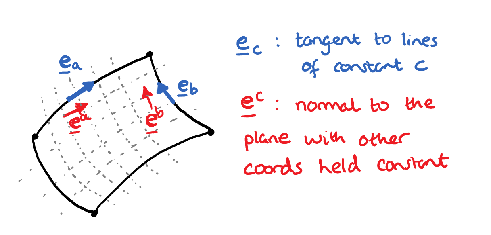
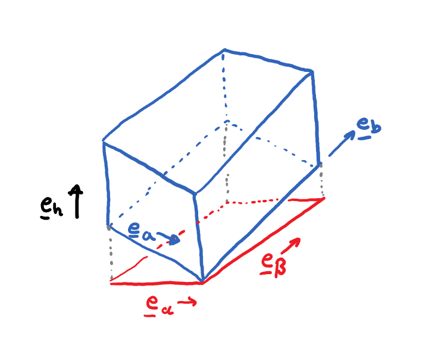

.. ------------------------------------------------------------------------------
     (c) Crown copyright Met Office. All rights reserved.
     The file LICENCE, distributed with this code, contains details of the terms
     under which the code may be used.
   ------------------------------------------------------------------------------

.. _coordinates_and_vectors_non_orthogonal_wind_components:

Non-Orthogonal Wind Components
==============================

This page converts the wind-component note into Sphinx format. It explains the
basis and dual-basis conventions used for wind components in non-orthogonal
coordinates, and shows how the model-space interpretation relates to ordinary
orthogonal horizontal and vertical components.

Computational values in LFRic
-----------------------------

Two statements from the source note motivate the discussion:

* The computational value at a face :math:`\Gamma` of a :math:`\mathbb{W}_2`
  field :math:`\mathbf{u}` corresponds to

  .. math::

      \int_\Gamma \mathbf{u}\cdot\widehat{\mathbf{n}}\,\mathrm{d}S,

  where :math:`\widehat{\mathbf{n}}` is the unit normal to the face.

* The computational value at an edge :math:`\gamma` of a :math:`\mathbb{W}_1`
  field :math:`\boldsymbol{\xi}` corresponds to

  .. math::

      \int_\gamma \boldsymbol{\xi}\cdot\widehat{\mathbf{t}}\,\mathrm{d}l,

  where :math:`\widehat{\mathbf{t}}` is the unit tangent to the edge.

In non-orthogonal geometry, these quantities are naturally tied to specific
basis and dual-basis directions rather than to simple Cartesian components.

The difference between basis vectors and dual basis vectors
-----------------------------------------------------------

For a coordinate :math:`a`, the basis vector is tangent to coordinate lines:

.. math::

    \mathbf{e}_a = \frac{\partial\boldsymbol{\chi}}{\partial a}.

The dual basis vector is normal to the surface that keeps the other
coordinates constant:

.. math::

    \mathbf{e}^a = \nabla a.

Dual basis vectors can only be defined once the whole basis has been chosen.

    Difference between basis vectors and dual basis vectors in two dimensions.

Contravariant and covariant components
--------------------------------------

When writing a vector field :math:`\mathbf{v}` through components, it is
typical to use either

.. math::

    \mathbf{v} = \sum_i v^i\,\widehat{\mathbf{e}}_i

with contravariant components and basis vectors, or

.. math::

    \mathbf{v} = \sum_i v_i\,\widehat{\mathbf{e}}^i

with covariant components and dual basis vectors.

This is the conceptual basis for interpreting model-space vector components in
non-orthogonal coordinates.

Components in non-orthogonal coordinates
----------------------------------------

Consider a 2D cell that follows the terrain. The source note distinguishes four
unit vectors:

* :math:`\widehat{\mathbf{e}}_t`, tangent to the terrain;
* :math:`\widehat{\mathbf{e}}_z`, vertical;
* :math:`\widehat{\mathbf{e}}_x`, horizontal;
* :math:`\widehat{\mathbf{e}}_n`, normal to the terrain.

The pairs :math:`(\widehat{\mathbf{e}}_t, \widehat{\mathbf{e}}_z)` and
:math:`(\widehat{\mathbf{e}}_x, \widehat{\mathbf{e}}_n)` are related by dual
bases:

* for :math:`(\widehat{\mathbf{e}}_t, \widehat{\mathbf{e}}_z)`, the dual
  basis vectors are :math:`\widehat{\mathbf{e}}^t = \widehat{\mathbf{e}}_x`
  and :math:`\widehat{\mathbf{e}}^z = \widehat{\mathbf{e}}_n`;
* for :math:`(\widehat{\mathbf{e}}_x, \widehat{\mathbf{e}}_n)`, the dual
  basis vectors are :math:`\widehat{\mathbf{e}}^x = \widehat{\mathbf{e}}_t`
  and :math:`\widehat{\mathbf{e}}^n = \widehat{\mathbf{e}}_z`.

The source note then considers a vector written in the non-orthogonal basis:

.. math::

    \mathbf{v} = v^t\widehat{\mathbf{e}}_t + v^z\widehat{\mathbf{e}}_z.

Starting from an orthogonal horizontal/vertical representation
:math:`\mathbf{v} = u\widehat{\mathbf{e}}_x + w\widehat{\mathbf{e}}_z`, the
non-orthogonal components are obtained by taking inner products:

.. math::

    \mathbf{v}\cdot\widehat{\mathbf{e}}_x = u = v^t\widehat{\mathbf{e}}_t\cdot\widehat{\mathbf{e}}_x,

.. math::

    \mathbf{v}\cdot\widehat{\mathbf{e}}_z = w =
    v^t\widehat{\mathbf{e}}_t\cdot\widehat{\mathbf{e}}_z + v^z.

This gives

.. math::

    v^t = \frac{u}{\widehat{\mathbf{e}}_t\cdot\widehat{\mathbf{e}}_x}, \qquad
    v^z = w - u\frac{\widehat{\mathbf{e}}_t\cdot\widehat{\mathbf{e}}_z}
                 {\widehat{\mathbf{e}}_t\cdot\widehat{\mathbf{e}}_x}.

The same analysis applies to the other basis choices discussed in the source
note, including expressing the vector in the :math:`(\widehat{\mathbf{e}}_x,
\widehat{\mathbf{e}}_n)` basis or starting from analytic tangential and
normal components. In each case, the transformation is a linear change of
basis determined by dot products between the chosen unit vectors.

Practical implications
----------------------

When diagnosing or prescribing winds, it is important to distinguish between:

* orthogonal analytic components, for example horizontal/vertical or
  tangential/normal; and
* model-space components tied to the chosen basis and dual basis.

    A related three-dimensional basis and dual-basis illustration.

The original note also contains a terrain-following schematic and a conversion
matrix table comparing different component systems. The schematic asset was not
present in the extracted files, so it is not included here yet, but the
surrounding derivation and formulas from the note have been retained.
