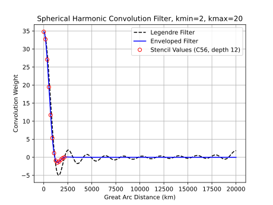

.. -----------------------------------------------------------------------------
    (c) Crown copyright Met Office. All rights reserved.
    The file LICENCE, distributed with this code, contains details of the terms
    under which the code may be used.

    Some of the content of this file has been produced with the assistance of
    Met Office GitHub Copilot Enterprise.
   -----------------------------------------------------------------------------
.. _nudging_science_convolution:

Filtering by Convolution
========================

The convolution method (see :ref:`nudging_science_formulation_convolution`)
applies a scale-selective filter :math:`\mathcal{L}` to the difference
between the model field and the reference field, so that only the large
scales are nudged. This section explains why the filter is applied as a
convolution in physical space, and derives the convolution kernel used on
the sphere.

Consider filtering a field :math:`f` so that only its large scales are
retained. Writing the spectrum of :math:`f` as :math:`\mathcal{F}[f]`,
where :math:`\mathcal{F}` denotes a transform to spectral space, the filter
:math:`\mathcal{L}` acts as a multiplication of the spectrum by a function
:math:`\ell` that varies with wavenumber:

.. math:: :label: eq:nudging_spectral_filter

   \mathcal{L}[f] = \mathcal{F}^{-1}\left[ \ell \; \mathcal{F}[f] \right] .

It is vital that :math:`\ell` does not amplify any wavenumbers, which will
cause the numerical model to go unstable. However, it is not always
necessary for an analytic form of :math:`\ell` to be preserved
exactly by the discretisation. For example, an idealised "top-hat" may be
specified for :math:`\ell`, but it may be acceptable for the discretisation to
only approximate this.

Why a convolution?
------------------

The most direct way to apply :eq:`eq:nudging_spectral_filter` would be to
transform :math:`f` to spectral space, multiply by :math:`\ell`, and
transform back. However, for a parallel implementation in which :math:`f`
is distributed geographically across many processors, this is very
inefficient: the transform requires global gather and scatter
communications and/or global summations, whose cost grows exponentially
with the number of processors.

An alternative is to note the convolution theorem: the spectrum of a
convolved field is the product of the spectra of the field and of the
convolving function. Defining the convolution of :math:`f` with a function
:math:`c` as

.. math:: :label: eq:nudging_convolution_def

   \mathcal{C}[f, c] := \int_\Omega f(\boldsymbol{y}) \; c(\boldsymbol{y} - \boldsymbol{x}) \; \mathrm{d}\boldsymbol{y} \equiv f \ast c ,

the convolution theorem gives
:math:`\mathcal{F}\!\left[\mathcal{C}[f, c]\right] = \mathcal{F}[f] \,
\mathcal{F}[c]`. Since the filter :eq:`eq:nudging_spectral_filter` acts as a
multiplication in spectral space, it can therefore be applied as a
convolution in physical space, provided the convolving function is chosen so
that :math:`\mathcal{F}[c] = \ell`, i.e. :math:`c = \mathcal{F}^{-1}[\ell]`.

The key advantage is that, if :math:`c` has compact support, the integral in
:eq:`eq:nudging_convolution_def` reduces to an integral over a local
neighbourhood of each point. On a distributed mesh this requires only
communication of neighbouring data through *halo exchanges*, rather than the
global communications demanded by a spectral transform.

In practice the convolution is truncated by restricting it to a local
stencil of finite extent. The truncated kernel is no longer exactly equal to
:math:`\mathcal{F}^{-1}[\ell]`, but can remain a good approximation provided
the truncation occurs where :math:`c` is already small. When the nudging of
the spectrum does not need to be exact, this can be acceptable.

The filter on the sphere
------------------------

To apply this approach on the cubed-sphere, the convolution kernel must be
derived for the sphere. The cubed-sphere is non-orthogonal and has
discontinuities at panel edges, which makes a separable
longitude--latitude Fourier filter challenging. Instead, the field is
expanded in spherical harmonics, which are appropriate for quasi-uniform
meshes of the sphere. This use of a convolution for scale-selective
filtering on a cubed-sphere follows the approach of Thatcher and McGregor
(2009).

The spherical harmonics, as functions of co-latitude :math:`\theta` and
longitude :math:`\varphi`, may be written as

.. math:: :label: eq:nudging_spherical_harmonic

   Y_{lm}(\theta, \varphi) = N_{lm} \, e^{i m \varphi} \, P_{lm}(\cos\theta) ,

where :math:`P_{lm}` are the associated Legendre polynomials and
:math:`N_{lm}` is a normalisation chosen so that the :math:`Y_{lm}` are
orthonormal over the sphere. A field :math:`f` is expanded as
:math:`f(\theta,\varphi) = \sum_{l,m} a_{lm} Y_{lm}(\theta,\varphi)`.

We seek the convolution kernel :math:`c` that retains only the spherical
harmonic components with total wavenumber between :math:`k_{min}` and
:math:`k_{max}`. Since the spherical harmonics form an orthonormal basis,
this filter kernel can be written

.. math:: :label: eq:nudging_general_kernel

   c(\theta,\varphi,\theta',\varphi') =
   \sum_{l=k_{min}}^{k_{max}} \sum_{m=-l}^{l}
   F_{lm} \, Y_{lm}(\theta,\varphi) \, Y_{lm}^{\ast}(\theta',\varphi') .

The kernel should depend only on the distance between two points, and not on
their orientation. This requires that there is no dependence on :math:`m` or
:math:`\varphi`, so that :math:`F_{lm} = F_{l0}`. The sum over :math:`m` can
then be carried out using the spherical harmonic addition theorem,

.. math:: :label: eq:nudging_addition_theorem

   \sum_{m=-l}^{l} Y_{lm}(\theta,\varphi) \, Y_{lm}^{\ast}(\theta',\varphi')
   = \frac{2l+1}{4\pi} \, P_l\!\left(\cos\gamma\right) ,

where :math:`P_l` is the Legendre polynomial of degree :math:`l` and
:math:`\gamma` is the great-circle (central) angle between the two points.
Taking an idealised top-hat filter in spectral space, :math:`F_{l0} = 1`,
the kernel becomes a weighted sum of Legendre polynomials of the central
angle:

.. math:: :label: eq:nudging_kernel

   c(\gamma) = \sum_{l=k_{min}}^{k_{max}} \frac{2l+1}{4\pi} \, P_l(\cos\gamma) .

The Legendre polynomials may be evaluated efficiently using the recurrence
relation

.. math:: :label: eq:nudging_legendre_recurrence

   \begin{aligned}
     P_0(\cos\gamma) &= 1 , \\
     P_1(\cos\gamma) &= \cos\gamma , \\
     P_l(\cos\gamma) &= \frac{2l-1}{l} \cos\gamma \, P_{l-1}(\cos\gamma)
       - \frac{l-1}{l} \, P_{l-2}(\cos\gamma) .
   \end{aligned}

Equation :eq:`eq:nudging_kernel` is the kernel that corresponds exactly to
the idealised top-hat spectral filter. It resembles a :math:`\mathrm{sinc}`
function, (mainly!) decaying away from :math:`\gamma = 0`, and is evaluated at the
points of the stencil surrounding each grid point to give the discrete
convolution weights.

Convolution Envelope
--------------------

However the series of Legendre polynomials does not strictly have compact support
and extends over the whole sphere. An accurate convolution would therefore
require a stencil covering the whole domain.

Instead we truncate the filter to a local stencil. To avoid the spurious
amplification of any wavenumbers, the filter is multiplied by a Gaussian
envelope that decays to zero towards the edge of the stencil. The width of
this envelope is a configurable parameter of the scheme, and must be chosen
together with the stencil extent (see :ref:`nudging_user_index` for
guidance).

Thus the actual filter used is

.. math:: :label: eq:nudging_enveloped_kernel

   c(\gamma) = \left[ \sum_{l=k_{min}}^{k_{max}} \frac{2l+1}{4\pi}
   P_l(\cos\gamma) \right]
   \exp\left[ -\frac{1}{2} \left( \frac{\gamma}{\sigma} \right)^2 \right] ,

where :math:`\gamma` is the great-circle angle from the central point and
:math:`\sigma` is the width of the Gaussian envelope.

:numref:`fig_nudging_envelope` illustrates the effect of the envelope. The
underlying Legendre filter :eq:`eq:nudging_kernel` oscillates and decays only
slowly with distance, so that it does not have compact support. Multiplying
by the Gaussian envelope gives the enveloped filter, which decays smoothly to
zero well within the stencil, allowing the convolution to be truncated to a
local region with minimal error, provided the stencil is wide enough for the
envelope to have decayed sufficiently by its edge.

.. _fig_nudging_envelope:

   The spherical-harmonic convolution filter for a top-hat retaining total
   wavenumbers from :math:`k_{min} = 2` to :math:`k_{max} = 20`, plotted
   against great-circle distance. The underlying Legendre filter
   (black dashed, :eq:`eq:nudging_kernel`) oscillates and decays only slowly,
   whereas the enveloped filter (blue, :eq:`eq:nudging_enveloped_kernel`)
   decays smoothly to zero. The red circles show the discrete filter values
   sampled at the stencil points for a stencil of depth 12 on a C56 mesh.

